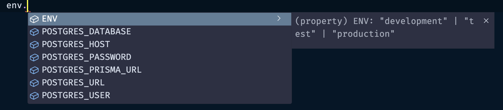

Create `env.ts` file and define schema with necessary ENV variables

```ts
// file: env.ts
import { z } from "zod";

const envSchema = z.object({
    POSTGRES_URL: z.string().url(),
    POSTGRES_PRISMA_URL: z.string().url(),
    POSTGRES_USER: z.string().min(1),
    POSTGRES_HOST: z.string().min(1),
    POSTGRES_PASSWORD: z.string().min(1),
    POSTGRES_DATABASE: z.string().min(1),
    ENV: z.union([
        z.literal("development"),
        z.literal("test"),
        z.literal("production"),
    ]),
});

// Validate `process.env` using the schema
const env = envSchema.parse(process.env);

export default env;
```

Code IntelliSense when using `env`


